# Project Title: EcoSort: Scalable Waste Classification Platform


## Table of Contents
- [Project Title: EcoSort: Scalable Waste Classification Platform](#project-title-ecosort-scalable-waste-classification-platform)
  - [Table of Contents](#table-of-contents)
  - [1. Create GKE Cluster](#1-create-gke-cluster)
    - [How-to Guide](#how-to-guide)
      - [1.1. Create Project in GCP](#11-create-project-in-gcp)
      - [1.2. Install gcloud CLI](#12-install-gcloud-cli)
      - [1.3. Install gke-cloud-auth-plugin](#13-install-gke-cloud-auth-plugin)
      - [1.4. Create a Service Account](#14-create-a-service-account)
      - [1.5. Add permission for Project](#15-add-permission-for-project)
      - [1.6. Deploy the GKE Cluster Using Terraform](#16-deploy-the-gke-cluster-using-terraform)
      - [1.7. Connect to the GKE Cluster](#17-connect-to-the-gke-cluster)
  - [2. Deploy serving service manually](#2-deploy-serving-service-manually)
    - [Step-by-Step Guide](#step-by-step-guide)
      - [2.1. Deploy Nginx Ingress Controller](#21-deploy-nginx-ingress-controller)
      - [2.2. Retrieve the Nginx Ingress IP Address](#22-retrieve-the-nginx-ingress-ip-address)
      - [2.3. Configure the Domain Name](#23-configure-the-domain-name)
      - [2.4. Test the API](#24-test-the-api)
      - [2.5. Running the FastAPI Server (Locally for Development)](#25-running-the-fastapi-server-locally-for-development)
      - [2.6. Access the API Documentation](#26-access-the-api-documentation)
  - [3. Deploy Monitoring Service](#3-deploy-monitoring-service)
    - [Step-by-Step Guide](#step-by-step-guide-1)
      - [3.1. Set Up Monitoring Namespace](#31-set-up-monitoring-namespace)
      - [3.2. Install Kube-Prometheus-Stack](#32-install-kube-prometheus-stack)
      - [3.3. Configure Access via NGINX Ingress](#33-configure-access-via-nginx-ingress)
      - [3.4. Accessing Services](#34-accessing-services)
  - [4. Deploy Jaeger for Distributed Tracing](#4-deploy-jaeger-for-distributed-tracing)
    - [Step-by-Step Guide](#step-by-step-guide-2)
      - [4.1. Set Up Tracing Namespace](#41-set-up-tracing-namespace)
      - [4.2. Deploy Jaeger with Helm](#42-deploy-jaeger-with-helm)
      - [4.3. Configure Host Access](#43-configure-host-access)
      - [4.4. Accessing Jaeger](#44-accessing-jaeger)
  - [5. Continuous deployment to GKE using Jenkins pipeline](#5-continuous-deployment-to-gke-using-jenkins-pipeline)
    - [5.1. Spin up your instance](#51-spin-up-your-instance)
    - [5.2. Install Docker and Jenkins in GCE](#52-install-docker-and-jenkins-in-gce)
    - [5.3. Connect to Jenkins UI in Compute Engine](#53-connect-to-jenkins-ui-in-compute-engine)
    - [5.4. Setup Jenkins](#54-setup-jenkins)
      - [5.4.1. Connect to Github repo](#541-connect-to-github-repo)
      - [5.4.2. Add Dockerhub credential to Jenkins at `Manage Jenkins/Credentials`](#542-add-dockerhub-credential-to-jenkins-at-manage-jenkinscredentials)
      - [5.4.3. Install the Kubernetes, Docker, Docker Pineline, GCloud SDK Plugins at `Manage Jenkins/Plugins`](#543-install-the-kubernetes-docker-docker-pineline-gcloud-sdk-plugins-at-manage-jenkinsplugins)
      - [5.4.4. Set up a connection to GKE by adding the cluster certificate key at `Manage Jenkins/Clouds`.](#544-set-up-a-connection-to-gke-by-adding-the-cluster-certificate-key-at-manage-jenkinsclouds)
      - [5.4.6. Install Helm on Jenkins to enable application deployment to GKE cluster.](#546-install-helm-on-jenkins-to-enable-application-deployment-to-gke-cluster)
    - [5.5. Continuous deployment](#55-continuous-deployment)
      - [📁 Directory Structure](#-directory-structure)
    - [5.6. Upload Model to PVC and Reinstall Application](#56-upload-model-to-pvc-and-reinstall-application)
    - [Step-by-Step Guide](#step-by-step-guide-3)
      - [5.6.1. Create a Persistent Volume Claim (PVC)](#561-create-a-persistent-volume-claim-pvc)
      - [5.6.2. Create a Temporary Pod to Download the Model](#562-create-a-temporary-pod-to-download-the-model)
      - [5.6.3. Update Deployment to Use PVC](#563-update-deployment-to-use-pvc)
  - [6. **Further Actions**](#6-further-actions)
    - [6.1. GitOps Integration](#61-gitops-integration)
    - [6.2. Autoscaling](#62-autoscaling)


## 1. Create GKE Cluster
### How-to Guide

#### 1.1. Create Project in GCP
Go to the [Google Cloud Console](https://console.cloud.google.com/projectcreate) and create a new project.
#### 1.2. Install gcloud CLI
Follow the [official documentation](https://cloud.google.com/sdk/docs/install#deb) to install the gcloud CLI.

Once installed, initialize gcloud CLI:

```bash
gcloud init
Y
```
+ A browser window will open, prompting you to select your Google account. Choose the one linked to your GCP subscription and click Allow.

+ Return to your terminal, select the project you created, and press Enter.

+ Choose the deployment region (e.g., us-central1-f) by typing the corresponding ID number, then press Enter.

#### 1.3. Install gke-cloud-auth-plugin
To authenticate with GKE, install the required plugin using:

```bash
sudo apt-get install google-cloud-cli-gke-gcloud-auth-plugin
```


#### 1.4. Create a Service Account

Create your [service account](https://console.cloud.google.com/iam-admin/serviceaccounts), and select `Kubernetes Engine Admin` role (Full management of Kubernetes Clusters and their Kubernetes API objects) for your service account.

Create new key as json type for your service account. Download this json file and save it in `terraform` directory. Update `credentials` in `terraform/main.tf` with your json directory.


#### 1.5. Add permission for Project
Go to [IAM](https://console.cloud.google.com/iam-admin/iam), click on `GRANT ACCESS`, then add new principals, this principal is your service account created in step 1.3. Finally, select `Owner` role.


#### 1.6. Deploy the GKE Cluster Using Terraform

Update your **project ID** in terraform/variables.tf, then execute the following commands to deploy the cluster:


```bash
gcloud auth application-default login
```

```bash
cd terraform
terraform init
terraform plan
terraform apply
```

This will deploy a GKE cluster in `asia-southeast1-b` with the following node configuration:

+ **Machine type**: n2-standard-2 (2 CPU, 8GB RAM, ~$71/month).
+ **Autopilot mode is disabled** to retain full control over features like Prometheus node metrics scraping, which is restricted in Autopilot mode.


The deployment process can take around **10 minutes**. You can monitor progress in the GKE UI.

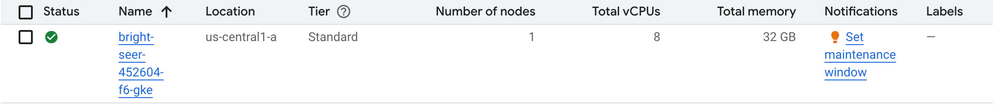
#### 1.7. Connect to the GKE Cluster
+ Open the [GKE UI](https://console.cloud.google.com/kubernetes/list).
+ Click on **the three-dot menu** next to your cluster and select **Connect**.

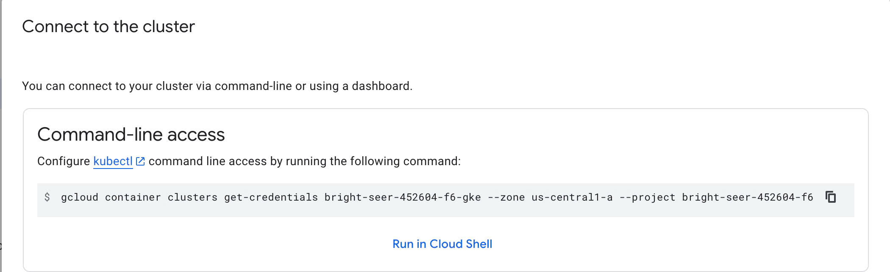
  

+ Copy the gcloud container `clusters get-credentials ...` command displayed in the pop-up window and run it in your terminal.
+ Verify the connection by running:

```bash
kubectx [YOUR_GKE_CLUSTER_ID]
```

## 2. Deploy serving service manually
We will use the [Helm chart](https://helm.sh/docs/topics/charts/) to deploy the application on a GKE cluster.

### Step-by-Step Guide


#### 2.1. Deploy Nginx Ingress Controller

To deploy the Nginx Ingress Controller in the `nginx-ingress` namespace, follow these steps:

1. **Navigate to the Helm chart directory**:
    ```bash
    cd helm/nginx_ingress
    ```

2. **Create the `nginx-ingress` namespace**:
    ```bash
    kubectl create ns nginx-ingress
    ```

3. **Switch to the `nginx-ingress` namespace**:
    ```bash
    kubens nginx-ingress
    ```

4. **Deploy the Nginx Ingress Controller**:
    ```bash
    helm upgrade --install nginx-ingress .
    ```

After completing these steps, the Nginx Ingress Controller will be deployed in the `nginx-ingress` namespace.

#### 2.2. Retrieve the Nginx Ingress IP Address

Once the Nginx Ingress Controller is deployed successfully, retrieve the IP address of the Ingress by running:


```bash
kubectl get ing
```

#### 2.3. Configure the Domain Name

1. **Edit the `/etc/hosts` file to map the Ingress IP address to the domain `ocr.example.com`. This ensures that the domain name points to your deployed application.**:
   
    ```bash
    sudo nano /etc/hosts
    ```
2. **Add the following entry to map the Ingress IP address to `ocr.example.com`**:
   
    ```bash
    [YOUR_INGRESS_IP_ADDRESS] ocr.example.com
    ```
Replace `[YOUR_INGRESS_IP_ADDRESS]` with the actual IP address you obtained from the kubectl get ing command.


#### 2.4. Test the API

Once the application is successfully deployed, you can test the API by visiting the following endpoints:

API Endpoints

1. Homepage:
   + Endpoint: /
   + Method: GET
   + Purpose: Returns a welcome message and instructions.
   + Response:
```bash
{
    "message": "Welcome to the OCR API. Use /predict to classify images or /get-advice for waste disposal."
}
```

2. Image Classification:
   + Endpoint: /predict
   + Method: POST
   + Purpose: Accepts an image file and returns its classification and confidence.
   + Input: Image file (multipart/form-data).
   + Response:
```bash
{
    "file_path": "path/to/uploaded/file.jpg",
    "prediction": "category_name",
    "confidence": 0.95
}
```

#### 2.5. Running the FastAPI Server (Locally for Development)

To run the FastAPI server locally for development, you can use uvicorn. Run the following command:

```bash
uvicorn main:app --host 0.0.0.0 --port 8000
```
This will start the server and bind it to all IP addresses on port 8000.

#### 2.6. Access the API Documentation

After the application is deployed, you can access the API documentation by navigating to:

```bash
ocr.example.com/docs
```
This will allow you to explore and test the API endpoints interactively.

🚀 Enjoy using your deployed OCR service!


After deployment, visit `ocr.example.com/docs` to explore and test the API. 🚀

## 3. Deploy Monitoring Service

To monitor the health of nodes and pods running the application, we will use **Prometheus** for metrics collection and **Grafana** for visualization. Prometheus gathers metrics from both nodes and pods within the GKE cluster, while Grafana displays real-time data such as CPU and RAM usage. Alerts regarding system health can be sent to a Discord channel.

### Step-by-Step Guide

#### 3.1. Set Up Monitoring Namespace
1. **Create and switch to the `monitoring` namespace**:

```bash
kubectl create ns monitoring
kubens monitoring
```

#### 3.2. Install Kube-Prometheus-Stack

1. Navigate to the chart folder and build Helm dependencies:


```bash
cd helm/k8s-monitoring/kube-prometheus-stack
helm dependency build
```

2. Deploy `kube-prometheus-stack` using Helm:

```bash
cd helm/k8s-monitoring
helm install -f kube-prometheus-stack.expanded.yaml kube-prometheus-stack kube-prometheus-stack -n monitoring
```


#### 3.3. Configure Access via NGINX Ingress

1. Edit your /etc/hosts file to map the ingress IP to custom domains:


```bash
sudo vim /etc/hosts
```

Add the following lines (replace `NGINX_EXTERNAL_IP` with your actual IP):

```bash
NGINX_EXTERNAL_IP prometheus.monitor.com
NGINX_EXTERNAL_IP grafana.monitor.com
```


#### 3.4. Accessing Services

Grafana Dashboard:

```bash
http://grafana.newssum.monitor.com/login
```


Prometheus Dashboard:

```bash
http://prometheus.newssum.monitor.com
```

**Note**:
+ Open [Firewall policies](https://console.cloud.google.com/net-security/firewall-manager/firewall-policies) to modify the protocols and ports corresponding to the node `Targets` in a GKE cluster. This will be accept incoming traffic on ports that you specific.
+ I'm using ephemeral IP addresses for the node, and these addresses will automatically change after a 24-hour period. You can change to static IP address for more stability or permanence.


Add Prometheus connector to Grafana with Prometheus server URL is: `[YOUR_NODEIP_ADDRESS]:30001`.

This is some `PromSQL` that you can use for monitoring the health of node and pod:

+ RAM usage of 2 pods that running application

```shell
container_memory_usage_bytes{container='app', namespace='model-serving'}
```

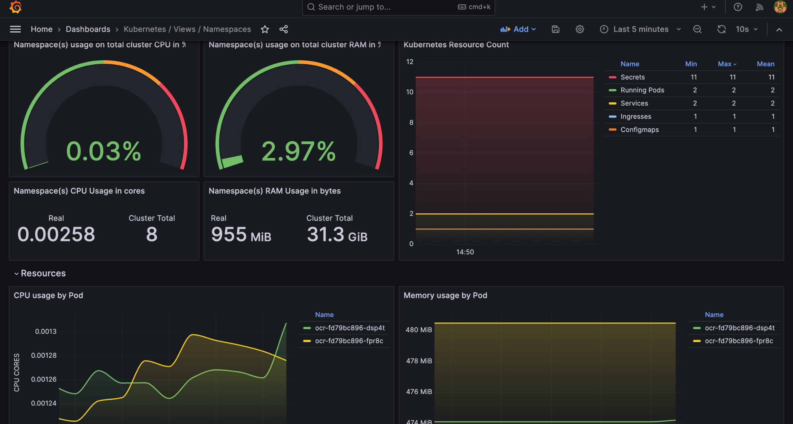


## 4. Deploy Jaeger for Distributed Tracing

To enable distributed tracing and visualize traces across services, we deploy **Jaeger**. This is useful for debugging, performance analysis, and understanding request flows between components in your FastAPI microservices. We use the **OpenTelemetry Collector** to export spans to Jaeger.


### Step-by-Step Guide

#### 4.1. Set Up Tracing Namespace

Create and switch to a dedicated namespace for Jaeger:

```bash
kubectl create ns tracing
kubens tracing
```

#### 4.2. Deploy Jaeger with Helm

We use a preconfigured Helm chart to deploy Jaeger along with OpenTelemetry Collector.

1. Navigate to Helm chart folder:

```bash
cd helm/jaeger
```
2. Install the Helm release with Jaeger

```bash
helm upgrade --install jaeger .
```

The jaeger-values.yaml file includes configuration for:

+ Jaeger collector and query services

+ OpenTelemetry Collector receiver/exporter pipelines

+ Ingress for exposing the Jaeger UI


#### 4.3. Configure Host Access

Edit your /etc/hosts file to map the ingress IP to Jaeger's custom domain:

```bash
sudo vim /etc/hosts
```

Add the following line (replace NGINX_EXTERNAL_IP with your actual ingress IP):

```bash
NGINX_EXTERNAL_IP jaeger.yourdomain.com
```


#### 4.4. Accessing Jaeger

Jaeger UI:

```bash
http://jaeger.yourdomain.com
```


**Example Trace UI**
Below is an example of what a trace looks like in the Jaeger dashboard:

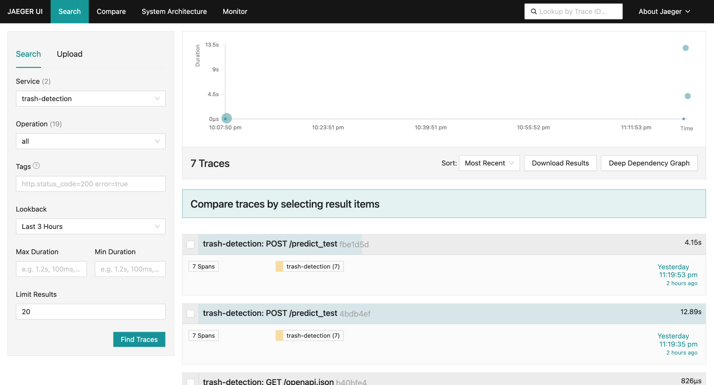


## 5. Continuous deployment to GKE using Jenkins pipeline

Jenkins is deployed on Google Compute Engine using [Ansible](https://docs.ansible.com/ansible/latest/playbook_guide/playbooks_intro.html) with a machine type is **n1-standard-2**.

### 5.1. Spin up your instance
Create your [service account](https://console.cloud.google.com/), and select [Compute Admin](https://cloud.google.com/compute/docs/access/iam#compute.admin) role (Full control of all Compute Engine resources) for your service account.

Create new key as json type for your service account. Download this json file and save it in `secret_keys` directory. Update your `project` and `service_account_file` in `ansible/deploy_jenkins/create_compute_instance.yaml`.

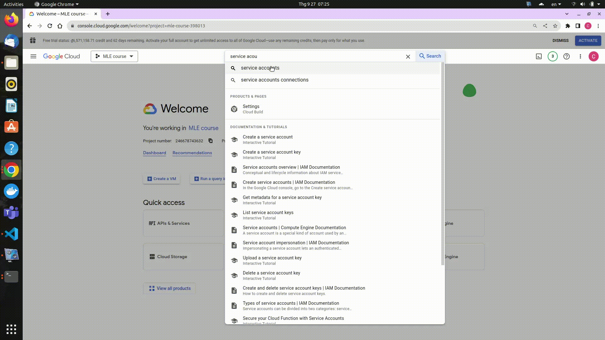


Go back to your terminal, please execute the following commands to create the Compute Engine instance:
```bash
cd ansible/deploy_jenkins
ansible-playbook create_compute_instance.yaml
```

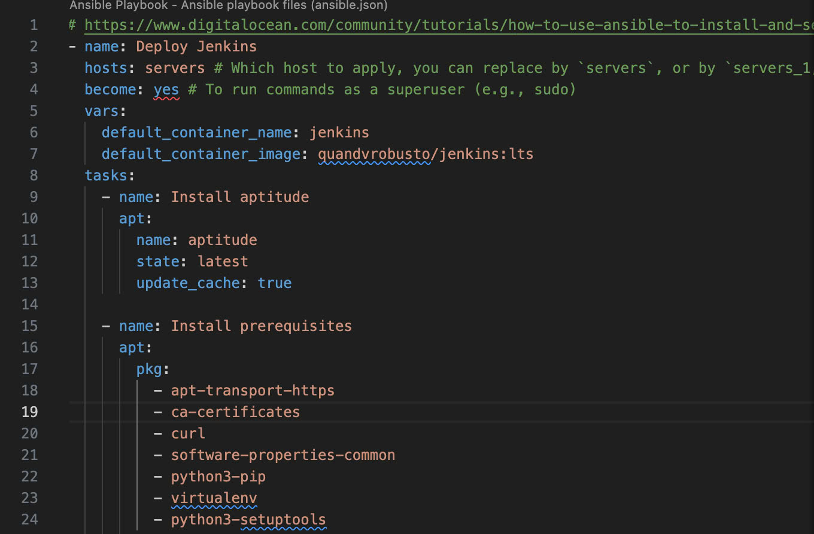


Go to Settings, select [Metadata](https://console.cloud.google.com/compute/metadata) and add your SSH key.

Update the IP address of the newly created instance and the SSH key for connecting to the Compute Engine in the inventory file.


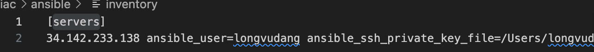

### 5.2. Install Docker and Jenkins in GCE

```bash
cd ansible/deploy_jenkins
ansible-playbook -i ../inventory deploy_jenkins.yaml
```

Wait a few minutes, if you see the output like this it indicates that Jenkins has been successfully installed on a Compute Engine instance.

### 5.3. Connect to Jenkins UI in Compute Engine
Access the instance using the command:
```bash
ssh -i ~/.ssh/id_rsa YOUR_USERNAME@YOUR_EXTERNAL_IP
```
Check if jenkins container is already running ?
```bash
sudo docker ps
```

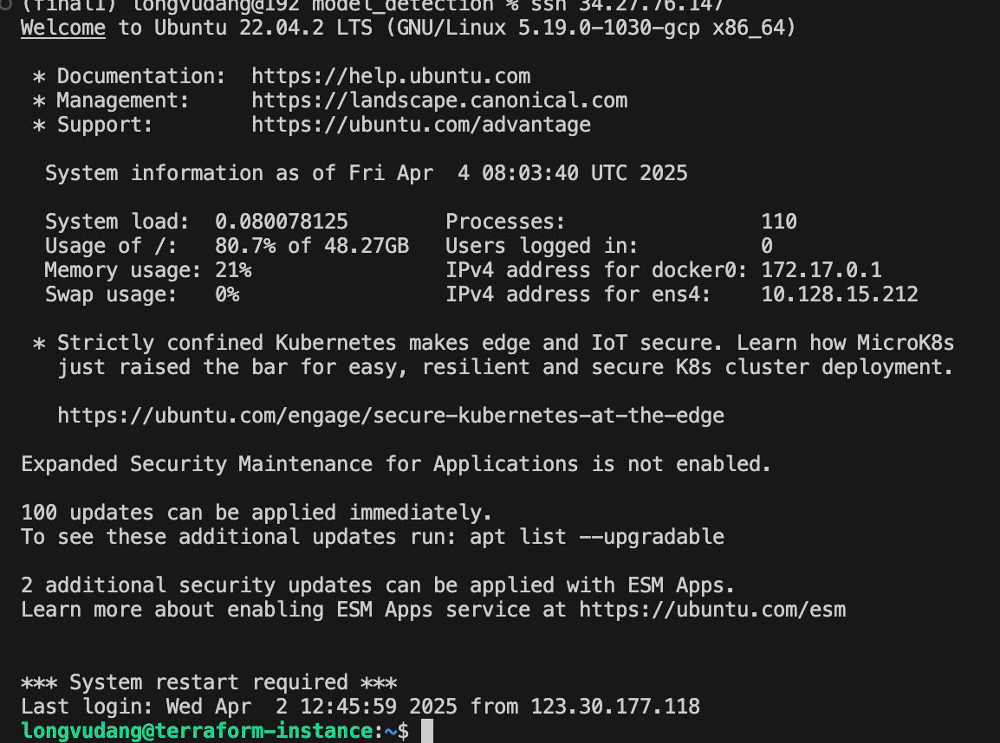

Open web brower and type `[YOUR_EXTERNAL_IP]:8081` for access Jenkins UI. To Unlock Jenkins, please execute the following commands:
```shell
sudo docker exec -ti jenkins bash
cat /var/jenkins_home/secrets/initialAdminPassword
```
Copy the password and you can access Jenkins UI.

It will take a few minutes for Jenkins to be set up successfully on their Compute Engine instance.


Go to Settings, select [Metadata](https://console.cloud.google.com/compute/metadata) and add your SSH key.

Update the IP address of the newly created instance and the SSH key for connecting to the Compute Engine in the inventory file.

Create your user ID, and Jenkins will be ready :D

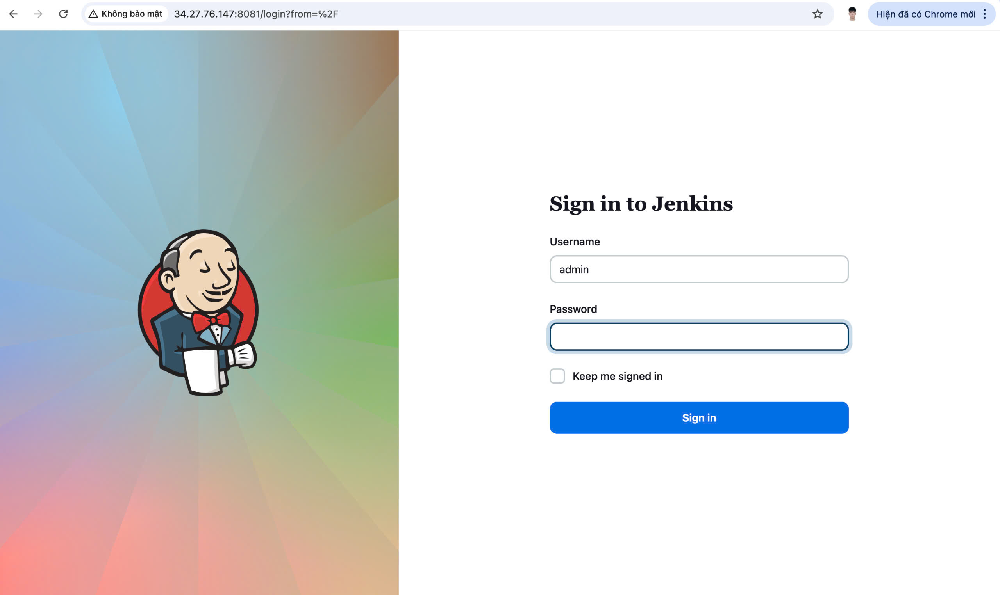


### 5.4. Setup Jenkins
#### 5.4.1. Connect to Github repo
+ Add Jenkins url to webhooks in Github repo

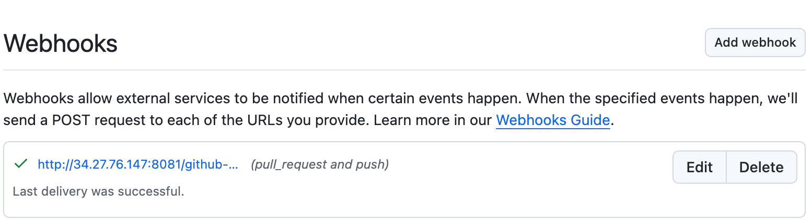
+ Add Github credential to Jenkins (select appropriate scopes for the personal access token)

#### 5.4.2. Add Dockerhub credential to Jenkins at `Manage Jenkins/Credentials`

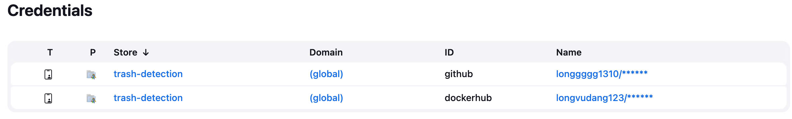


#### 5.4.3. Install the Kubernetes, Docker, Docker Pineline, GCloud SDK Plugins at `Manage Jenkins/Plugins`

After successful installation, restart the Jenkins container in your Compute Engine instance:
```bash
sudo docker restart jenkins
```

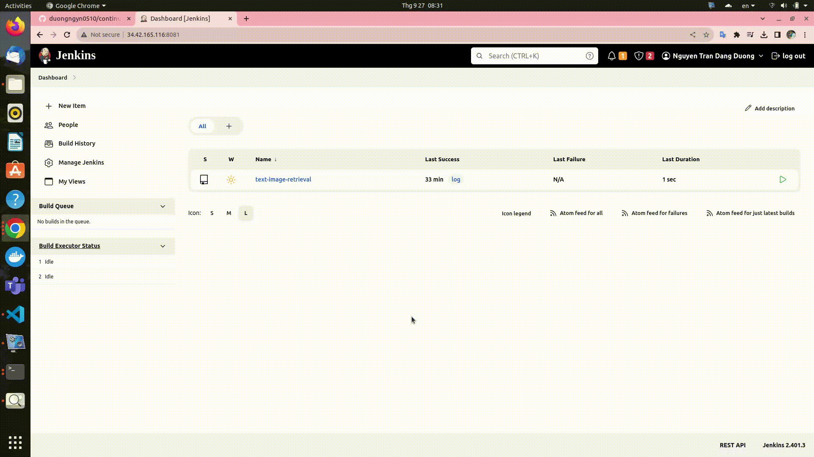


#### 5.4.4. Set up a connection to GKE by adding the cluster certificate key at `Manage Jenkins/Clouds`.

Don't forget to grant permissions to the service account which is trying to connect to our cluster by the following command:

```shell
kubectl create clusterrolebinding cluster-admin-binding --clusterrole=cluster-admin --user=system:anonymous

kubectl create clusterrolebinding cluster-admin-default-binding --clusterrole=cluster-admin --user=system:serviceaccount:model-serving:default
```

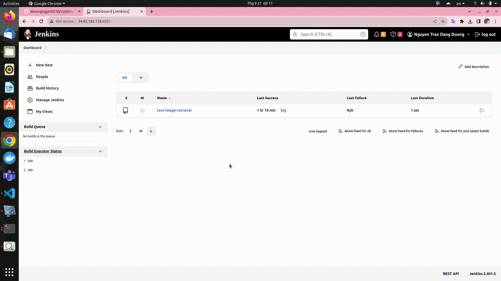

#### 5.4.6. Install Helm on Jenkins to enable application deployment to GKE cluster.

+ You can use the `Dockerfile-jenkins-k8s` to build a new Docker image. After that, push this newly created image to Dockerhub. Finally replace the image reference at `containerTemplate` in `Jenkinsfile` or you can reuse my image `longvudang123/jenkins:lts-jdk17`


### 5.5. Continuous deployment
Create `model-serving` namespace first in your GKE cluster
#### 📁 Directory Structure

```bash
model-detection/
├── Chart.yaml
├── values.yaml                # General configuration (image, ports, replicas, etc.)
├── values-secrets.yaml        # Sensitive values like hfApiKey (DO NOT commit this)
└── templates/
    ├── deployment.yaml
    ├── ingress.yaml
    ├── service.yaml
    └── secret.yaml
```

```bash
kubectl create ns model-serving
```

Create `values-secrets.yaml` for your secret key

```bash
hfApiKey: "your_hf_api_key_here"
```

Install or upgrade the Helm chart

```bash
kubens model-serving
helm upgrade --install ocr . -f values.yaml -f values-secrets.yaml
```

Add hfApiKey to Jenkins Credentials

1. **Go to Jenkins Dashboard:**
   - Open your Jenkins instance.

2. **Navigate to the Credentials Section:**
   - From the Jenkins dashboard, go to the **Credentials** section.

3. **Create a New Secret Text Credential:**
   - Click on the **(global)** link under the **Stores scoped to Jenkins** section.
   - Click on **Add Credentials** on the left side of the page.
   - In the **Kind** drop-down, select **Secret text**.

4. **Enter the Secret Information:**
   - In the **Secret** field, enter your API key (e.g., `hfApiKey`).
   - Set the **ID** to something recognizable, such as `hfApiKey-credential-id`.

5. **Save the Credentials:**
   - Click **OK** to save the credentials.

The CI/CD pipeline will consist of three stages:
+ Tesing model correctness.
    + Replace the new pretrained model in `app/main.py`. I recommend accessing the pretrained model by downloading it from another storage, such as Google Drive or Hugging Face.
    + If you store the pretrained model directly in a directory and copy it to the Docker image during the application build, it may consume a significant amount of resource space (RAM) in the pod. This can result in pods not being started successfully.
+ Building the image, and pushing the image to Docker Hub.
+ Finally, it will deploy the application with the latest image from DockerHub to GKE cluster.

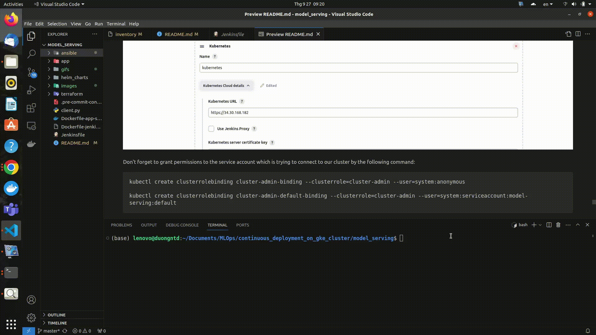


The pipeline will take about 8 minutes. You can confirm the successful deployment of the application to the GKE cluster if you see the following output in the pipeline log:
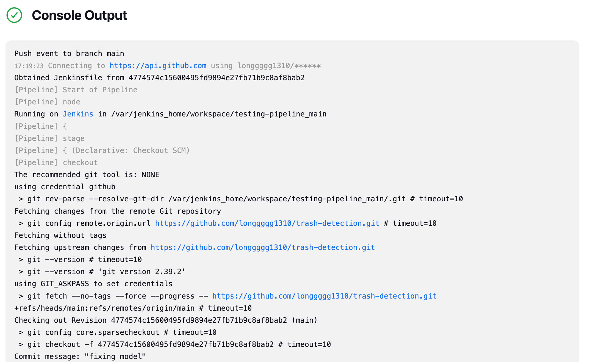

Here is the Stage view in Jenkins pipeline:

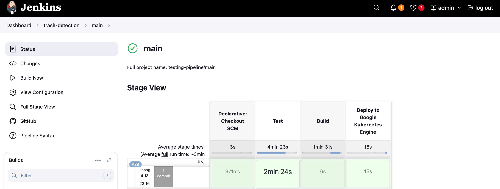


As part of the Continuous Deployment pipeline, automated tests are executed to ensure the correctness of the model and application functionality before deployment. The testing framework used is pytest, and code coverage is measured to assess the extent of the codebase being tested.

Test Execution and Results
The test session is initiated in the Jenkins pipeline to validate the application. Below is the output from a sample test session:


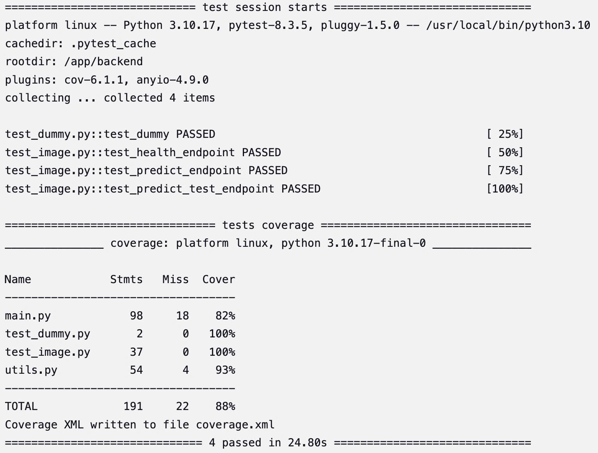


**Coverage Report**: The code coverage analysis shows that 88% of the total statements (191) in the codebase were executed during testing, with 22 statements missed. Key files include:
main.py: 82% coverage (98 statements, 18 missed).
+ test_dummy.py: 100% coverage (2 statements, 0 missed).
+ test_image.py: 100% coverage (37 statements, 0 missed).
+ utils.py: 93% coverage (54 statements, 4 missed).

**Coverage Output**: The coverage report is exported to coverage.xml for further analysis or integration with other tools.

Check whether the pods have been deployed successfully in the `models-serving` namespace.

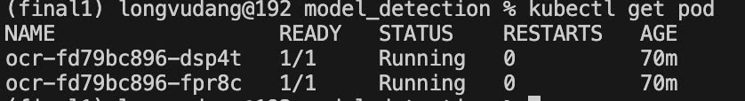

Test the API

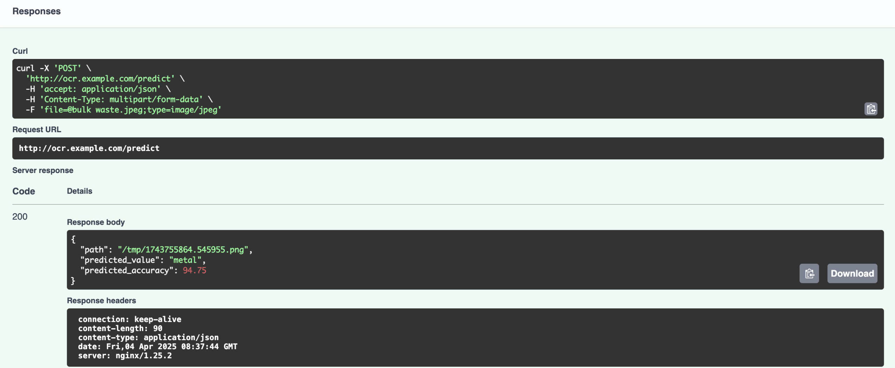


### 5.6. Upload Model to PVC and Reinstall Application

To ensure the model is uploaded to a Persistent Volume Claim (PVC) before the application is deployed, we will create a temporary Pod to download the model from a storage source (e.g., Google Drive, Hugging Face, or a public URL). Once the model is downloaded into the PVC, the temporary Pod will be deleted, and the application will be reinstalled using Helm to utilize the model from the PVC.


### Step-by-Step Guide

#### 5.6.1. Create a Persistent Volume Claim (PVC)
First, create a PVC to store the model. Add the PVC configuration to your Helm chart directory `(model-detection/templates/pvc.yaml)`:

```bash
apiVersion: v1
kind: PersistentVolumeClaim
metadata:
  name: ocr-model-pvc
  namespace: model-serving
spec:
  accessModes:
    - ReadWriteOnce
  resources:
    requests:
      storage: 1Gi
  storageClassName: standard
```
#### 5.6.2. Create a Temporary Pod to Download the Model

Create a temporary Pod to download the model from a storage source (e.g., Hugging Face, Google Drive) and save it to the PVC. Add a file `init-model-pod.yaml` to the `model-detection/templates/` directory:


```bash
apiVersion: v1
kind: Pod
metadata:
  name: upload-model-pod
  namespace: model-serving
spec:
  restartPolicy: Never
  containers:
    - name: model-uploader
      image: longvudang123/model:latest
      command:
        - /bin/sh
        - -c
        - |
          echo "Changing permissions..."
          chmod -R 777 /mnt/data
          echo "Uploading model to PVC..."
          cp -r /model-checkpoints/* /app/backend/models/
      volumeMounts:
        - name: model-volume
          mountPath: /app/backend/models  
        - name: model-volume
          mountPath: /mnt/data
  volumes:
    - name: model-volume
      persistentVolumeClaim:
        claimName: ocr-model-pvc
```

#### 5.6.3. Update Deployment to Use PVC

Update `deployment.yaml` in the `model-detection/templates/` directory to mount the PVC into the application container:


```bash
volumeMounts:
            - name: model-volume
              mountPath: /app/backend/models
      volumes:
        - name: model-volume
          persistentVolumeClaim:
            claimName: ocr-model-pvc
```

## 6. **Further Actions**
### 6.1. GitOps Integration
Implement GitOps using ArgoCD or Flux to automate deployments and synchronize the cluster state from a Git repository.

### 6.2. Autoscaling
Configure Horizontal Pod Autoscaler and Node Auto-provisioning to enable dynamic scaling based on workload demands.