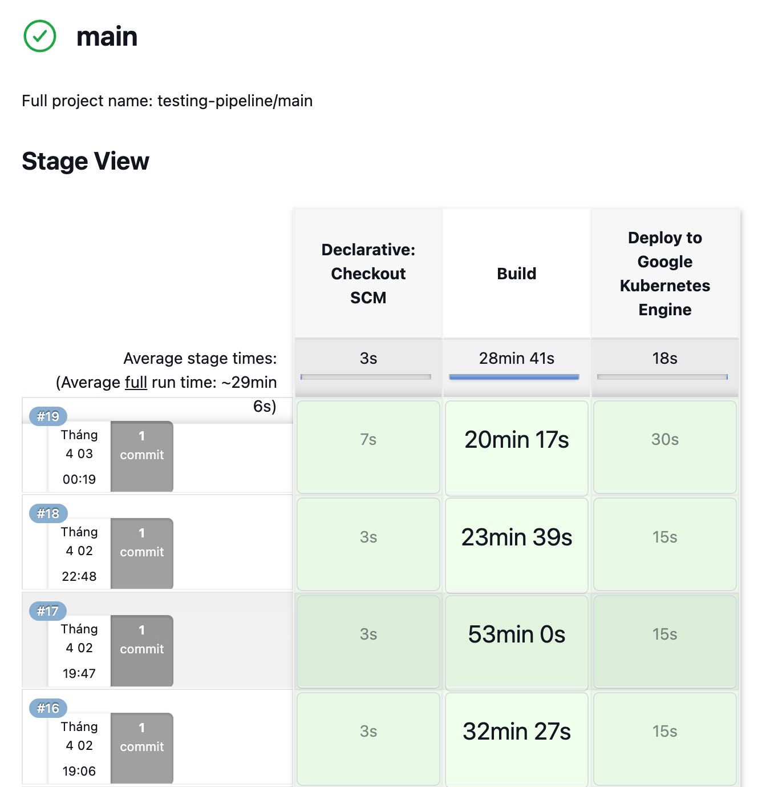

- [1. Create GKE Cluster](#1-create-gke-cluster)
  - [How-to Guide](#how-to-guide)
    - [1.1. Create Project in GCP](#11-create-project-in-gcp)
    - [1.2. Install gcloud CLI](#12-install-gcloud-cli)
    - [1.3. Install gke-cloud-auth-plugin](#13-install-gke-cloud-auth-plugin)
    - [1.4. Create a Service Account](#14-create-a-service-account)
    - [1.5. Add permission for Project](#15-add-permission-for-project)
    - [1.6. Deploy the GKE Cluster Using Terraform](#16-deploy-the-gke-cluster-using-terraform)
    - [1.7. Connect to the GKE Cluster](#17-connect-to-the-gke-cluster)
- [2. Deploy serving service manually](#2-deploy-serving-service-manually)
  - [Step-by-Step Guide](#step-by-step-guide)
    - [2.1. Deploy Nginx Ingress Controller](#21-deploy-nginx-ingress-controller)
      - [API Endpoints](#api-endpoints)
      - [Running the FastAPI Server](#running-the-fastapi-server)
- [3. Deploy Monitoring Service](#3-deploy-monitoring-service)
  - [Step-by-Step Guide](#step-by-step-guide-1)
    - [Monitoring System](#monitoring-system)
- [4. Continuous deployment to GKE using Jenkins pipeline](#4-continuous-deployment-to-gke-using-jenkins-pipeline)
  - [4.1. Spin up your instance](#41-spin-up-your-instance)
  - [4.2. Install Docker and Jenkins in GCE](#42-install-docker-and-jenkins-in-gce)
  - [4.3. Connect to Jenkins UI in Compute Engine](#43-connect-to-jenkins-ui-in-compute-engine)
  - [4.4. Setup Jenkins](#44-setup-jenkins)
    - [4.4.1. Connect to Github repo](#441-connect-to-github-repo)
    - [4.4.2. Add Dockerhub credential to Jenkins at `Manage Jenkins/Credentials`](#442-add-dockerhub-credential-to-jenkins-at-manage-jenkinscredentials)
    - [4.4.3. Install the Kubernetes, Docker, Docker Pineline, GCloud SDK Plugins at `Manage Jenkins/Plugins`](#443-install-the-kubernetes-docker-docker-pineline-gcloud-sdk-plugins-at-manage-jenkinsplugins)
    - [4.4.4. Set up a connection to GKE by adding the cluster certificate key at `Manage Jenkins/Clouds`.](#444-set-up-a-connection-to-gke-by-adding-the-cluster-certificate-key-at-manage-jenkinsclouds)
    - [4.4.6. Install Helm on Jenkins to enable application deployment to GKE cluster.](#446-install-helm-on-jenkins-to-enable-application-deployment-to-gke-cluster)
  - [4.5. Continuous deployment](#45-continuous-deployment)


## 1. Create GKE Cluster
### How-to Guide

#### 1.1. Create Project in GCP
Go to the [Google Cloud Console](https://console.cloud.google.com/projectcreate) and create a new project.
#### 1.2. Install gcloud CLI
Follow the [official documentation](https://cloud.google.com/sdk/docs/install#deb) to install the gcloud CLI.

Once installed, initialize gcloud CLI:

```bash
gcloud init
Y
```
+ A browser window will open, prompting you to select your Google account. Choose the one linked to your GCP subscription and click Allow.

+ Return to your terminal, select the project you created, and press Enter.

+ Choose the deployment region (e.g., us-central1-f) by typing the corresponding ID number, then press Enter.

#### 1.3. Install gke-cloud-auth-plugin
To authenticate with GKE, install the required plugin using:

```bash
sudo apt-get install google-cloud-cli-gke-gcloud-auth-plugin
```


#### 1.4. Create a Service Account

Create your [service account](https://console.cloud.google.com/iam-admin/serviceaccounts), and select `Kubernetes Engine Admin` role (Full management of Kubernetes Clusters and their Kubernetes API objects) for your service account.

Create new key as json type for your service account. Download this json file and save it in `terraform` directory. Update `credentials` in `terraform/main.tf` with your json directory.


#### 1.5. Add permission for Project
Go to [IAM](https://console.cloud.google.com/iam-admin/iam), click on `GRANT ACCESS`, then add new principals, this principal is your service account created in step 1.3. Finally, select `Owner` role.


#### 1.6. Deploy the GKE Cluster Using Terraform

Update your **project ID** in terraform/variables.tf, then execute the following commands to deploy the cluster:


```bash
gcloud auth application-default login
```

```bash
cd terraform
terraform init
terraform plan
terraform apply
```

This will deploy a GKE cluster in `asia-southeast1-b` with the following node configuration:

+ **Machine type**: n2-standard-2 (2 CPU, 8GB RAM, ~$71/month).
+ **Autopilot mode is disabled** to retain full control over features like Prometheus node metrics scraping, which is restricted in Autopilot mode.


The deployment process can take around **10 minutes**. You can monitor progress in the GKE UI.


#### 1.7. Connect to the GKE Cluster
+ Open the [GKE UI](https://console.cloud.google.com/kubernetes/list).
+ Click on **the three-dot menu** next to your cluster and select **Connect**.


  

+ Copy the gcloud container `clusters get-credentials ...` command displayed in the pop-up window and run it in your terminal.
+ Verify the connection by running:

```bash
kubectx [YOUR_GKE_CLUSTER_ID]
```

## 2. Deploy serving service manually
Using [Helm chart](https://helm.sh/docs/topics/charts/) to deploy application on GKE cluster.


### Step-by-Step Guide
#### 2.1. Deploy Nginx Ingress Controller

To deploy the Nginx Ingress Controller in the `nginx-ingress` namespace, run the following commands:

```bash
cd helm/nginx_ingress
kubectl create ns nginx-ingress
kubens nginx-ingress
helm upgrade --install nginx-ingress .
```
After that, nginx ingress controller will be created in `nginx-ingress` namespace.

Once the application is successfully deployed on the GKE cluster, you can test the API by following these steps:

+ Retrieve the Nginx Ingress IP Address

```bash
kubectl get ing
```

+   Add the domain name `ocr.example.com` (set up in `helm/app/templates/app_ingress.yaml`) of this IP to `/etc/hosts`
  
```bash
sudo nano /etc/hosts
[YOUR_INGRESS_IP_ADDRESS] ocr.example.com
```

##### API Endpoints

Homepage
+ Endpoint: /
+ Method: GET
+ Purpose: Returns a welcome message and instructions.
+ Response:

```bash
{
    "message": "Welcome to the OCR API. Use /predict to classify images or /get-advice for waste disposal."
}
```
Image Classification
+ Endpoint: /predict
+ Method: POST
+ Purpose: Accepts an image file and returns its classification and confidence.
+ Input: Image file (multipart/form-data).
+ Response:
```bash
{
    "file_path": "path/to/uploaded/file.jpg",
    "prediction": "category_name",
    "confidence": 0.95
}
```

##### Running the FastAPI Server

Run the FastAPI server with uvicorn:

```bash
uvicorn main:app --host 0.0.0.0 --port 8000
```

After deployment, visit `ocr.example.com/docs` to explore and test the API. 🚀

## 3. Deploy Monitoring Service

For monitoring the health of nodes and pods running the application, we will use **Prometheus** for metrics collection and **Grafana** for visualization. Prometheus will gather metrics from both nodes and pods within the GKE cluster, while Grafana will display real-time data such as CPU and RAM usage. Alerts on system health will be sent to Discord.

### Step-by-Step Guide

#### Monitoring System
- Create and switch to namespace `monitoring`
    ``` shell
    kubectl create ns monitoring
    kubens monitoring
    ```

- Get dependencies to build `kube-prometheus-stack`
    ``` shell
    cd helm/k8s-monitoring/kube-prometheus-stack
    helm dependency build
    ```

- Deploy `kube-prometheus-stack` using `helm`
    ```shell
    cd helm/k8s-monitoring
    helm install -f kube-prometheus-stack.expanded.yaml kube-prometheus-stack kube-prometheus-stack -n monitoring
    ```

- Edit **hosts**
  - Add 2 hosts of `grafana` and `prometheus` at the end of `/ect/hosts`
    ```
    sudo vim /ect/hosts
    ```
    ```
    NGINX_EXTERNAL_IP prometheus.newssum.monitor.com
    NGINX_EXTERNAL_IP grafana.newssum.monitor.com
    ```

- Grafana can be accessed at `http://grafana.newssum.monitor.com/login`

- Prometheus can be accessed at `http://prometheus.newssum.monitor.com`


**Note**:
+ Open [Firewall policies](https://console.cloud.google.com/net-security/firewall-manager/firewall-policies) to modify the protocols and ports corresponding to the node `Targets` in a GKE cluster. This will be accept incoming traffic on ports that you specific.
+ I'm using ephemeral IP addresses for the node, and these addresses will automatically change after a 24-hour period. You can change to static IP address for more stability or permanence.


Add Prometheus connector to Grafana with Prometheus server URL is: `[YOUR_NODEIP_ADDRESS]:30001`.

This is some `PromSQL` that you can use for monitoring the health of node and pod:

+ RAM usage of 2 pods that running application

```shell
container_memory_usage_bytes{container='app', namespace='model-serving'}
```


## 4. Continuous deployment to GKE using Jenkins pipeline

Jenkins is deployed on Google Compute Engine using [Ansible](https://docs.ansible.com/ansible/latest/playbook_guide/playbooks_intro.html) with a machine type is **n1-standard-2**.

### 4.1. Spin up your instance
Create your [service account](https://console.cloud.google.com/), and select [Compute Admin](https://cloud.google.com/compute/docs/access/iam#compute.admin) role (Full control of all Compute Engine resources) for your service account.

Create new key as json type for your service account. Download this json file and save it in `secret_keys` directory. Update your `project` and `service_account_file` in `ansible/deploy_jenkins/create_compute_instance.yaml`.


Go back to your terminal, please execute the following commands to create the Compute Engine instance:
```bash
cd ansible/deploy_jenkins
ansible-playbook create_compute_instance.yaml
```


Go to Settings, select [Metadata](https://console.cloud.google.com/compute/metadata) and add your SSH key.

Update the IP address of the newly created instance and the SSH key for connecting to the Compute Engine in the inventory file.


### 4.2. Install Docker and Jenkins in GCE

```bash
cd ansible/deploy_jenkins
ansible-playbook -i ../inventory deploy_jenkins.yaml
```

Wait a few minutes, if you see the output like this it indicates that Jenkins has been successfully installed on a Compute Engine instance.

### 4.3. Connect to Jenkins UI in Compute Engine
Access the instance using the command:
```bash
ssh -i ~/.ssh/id_rsa YOUR_USERNAME@YOUR_EXTERNAL_IP
```
Check if jenkins container is already running ?
```bash
sudo docker ps
```


Open web brower and type `[YOUR_EXTERNAL_IP]:8081` for access Jenkins UI. To Unlock Jenkins, please execute the following commands:
```shell
sudo docker exec -ti jenkins bash
cat /var/jenkins_home/secrets/initialAdminPassword
```
Copy the password and you can access Jenkins UI.

It will take a few minutes for Jenkins to be set up successfully on their Compute Engine instance.


Go to Settings, select [Metadata](https://console.cloud.google.com/compute/metadata) and add your SSH key.

Update the IP address of the newly created instance and the SSH key for connecting to the Compute Engine in the inventory file.

Create your user ID, and Jenkins will be ready :D


### 4.4. Setup Jenkins
#### 4.4.1. Connect to Github repo
+ Add Jenkins url to webhooks in Github repo


+ Add Github credential to Jenkins (select appropriate scopes for the personal access token)

#### 4.4.2. Add Dockerhub credential to Jenkins at `Manage Jenkins/Credentials`


#### 4.4.3. Install the Kubernetes, Docker, Docker Pineline, GCloud SDK Plugins at `Manage Jenkins/Plugins`

After successful installation, restart the Jenkins container in your Compute Engine instance:
```bash
sudo docker restart jenkins
```


#### 4.4.4. Set up a connection to GKE by adding the cluster certificate key at `Manage Jenkins/Clouds`.

Don't forget to grant permissions to the service account which is trying to connect to our cluster by the following command:

```shell
kubectl create clusterrolebinding cluster-admin-binding --clusterrole=cluster-admin --user=system:anonymous

kubectl create clusterrolebinding cluster-admin-default-binding --clusterrole=cluster-admin --user=system:serviceaccount:model-serving:default
```


#### 4.4.6. Install Helm on Jenkins to enable application deployment to GKE cluster.

+ You can use the `Dockerfile-jenkins-k8s` to build a new Docker image. After that, push this newly created image to Dockerhub. Finally replace the image reference at `containerTemplate` in `Jenkinsfile` or you can reuse my image `quandvrobusto/jenkins:lts`


### 4.5. Continuous deployment
Create `model-serving` namespace first in your GKE cluster
```bash
kubectl create ns model-serving
```

The CI/CD pipeline will consist of three stages:
+ Tesing model correctness.
    + Replace the new pretrained model in `app/main.py`. I recommend accessing the pretrained model by downloading it from another storage, such as Google Drive or Hugging Face.
    + If you store the pretrained model directly in a directory and copy it to the Docker image during the application build, it may consume a significant amount of resource space (RAM) in the pod. This can result in pods not being started successfully.
+ Building the image, and pushing the image to Docker Hub.
+ Finally, it will deploy the application with the latest image from DockerHub to GKE cluster.


The pipeline will take about 8 minutes. You can confirm the successful deployment of the application to the GKE cluster if you see the following output in the pipeline log:


Here is the Stage view in Jenkins pipeline:



Check whether the pods have been deployed successfully in the `models-serving` namespace.


Test the API


